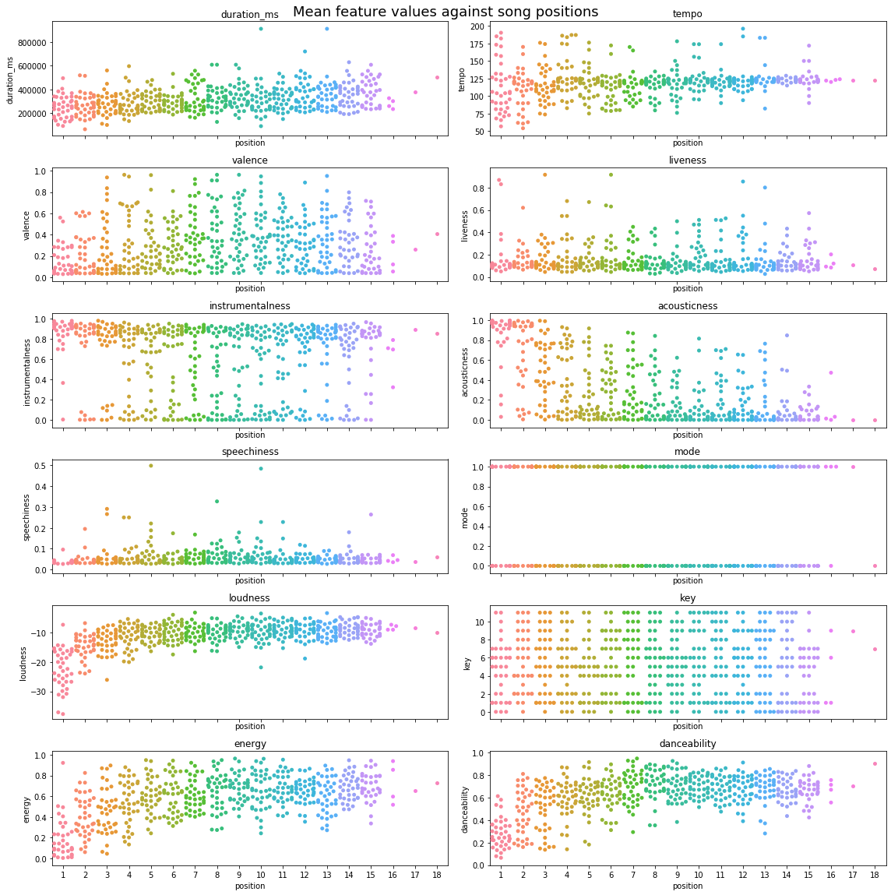
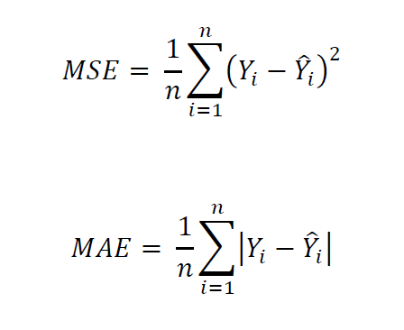
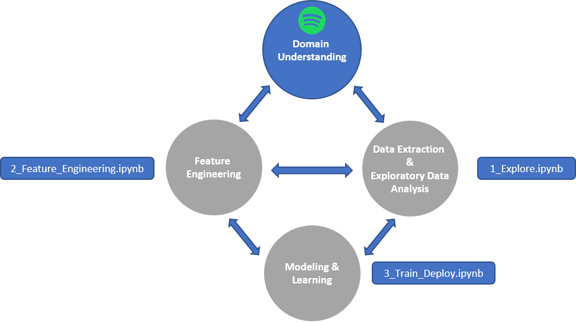

# Machine Learning Engineer Nanodegree
## Capstone Proposal
Alistair Wilson Gillespie  
March 3, 2020

## Proposal
### Domain Background
Spotify is the leading incumbent of the music streaming industry boasting a dominant market share. To satisfy it's ever-evolving audience and fend off competitors, it's harnesses an army  of engineers and data scientists to  infuse recommendation systems throughout the Spotify interface to deliver unique and dynamic listening experiences tailored to its users' preferences.

Wilson's Morning Wake Up (WMW) is a Spotify playlist I curate each month; the playlist is designed 
to build tempo as the listener starts their day with no more than 15 tracks; and explores a range of genres including house, classical, funk and jazz, to name a few. Ultimately, WMW is structured in a way as to deliver harmonic sequences of tunes that meld into an hour of blissful listening.

For this project, I propose an approach for sequence-based playlist generation using deep learning. The aim is to build a model that can generate playlists that closely resemble the unique qualities and nature of Wilson's Morning Wake Up. 

### Problem Statement
The objective of this project is to build a deep playlist generator capable of producing playlists of the same quality and structure as Wilson's Morning Wake Up. The solution will perform the following tasks:

1. Extract and transform track metadata from all the Wilson's Morning Wake Up volumes 
   to-date using the Spotify for Developers API

2. Train an estimator that generates sequence-based track features
3. Extract a batch of recommended tracks from a set of genres using Spotify's API

4. Generate a playlist of 15 tracks using the estimator and recommended tracks

Moreover, the solution should generalize to not only my own playlists but any other user-defined playlists with the aim of providing playlist curators with a tool for creating quality mixes, more frequently.

### Datasets and Inputs
The WMW dataset comprises 38 volumes each containing no more than 15 tracks. There is a total of 554 tracks in the dataset. The data is extracted via the Spotify for developers API and includes a set of audio features engineered by the Spotify team. Furthermore, I've included an additional attribute for track position.

The following features have been selected to extract the appropriate information related to each track and playlist:

- *acousticness*: confidence score of whether the track is acoustic (float)
- *danceability*: how suitable the track is for dancing based on a combination of musical elements (float)
- *energy*: measure of the intensity and activity of the track (float)
- *instrumentalness*: confidence score of whether the track has vocals or not (float)
- *liveness*: detects presence of an audience in the recording (float)
- *loudness*: overall loudness of a track in decibels (float)
- *speechiness*: detects presence of spoken words in a track (float)
- *tempo*: estimated tempo of a track in beats per minute (BPM) (float)
- *popularity*: popularity of the track represented by a value between 0 and 100, with 100 being the
 most popular (integer)
- *genres*: a list of genres used to classify the album the track features in (array of strings)
- *song position*: position of the track in its respective WMW volume




<center><b>Fig. 1: Mean features values against track position </b></center>


Further information regarding the audio features can be found [here](https://developer.spotify.com/documentation/web-api/reference/tracks/get-several-audio-features/).

In addition to the track dataset, the application will require a batch of candidate tracks to pick from to generate a new playlist. Again, the Spotify API will be used to gather recommended tracks based on seeded artists, genres and tracks. In the future, as an extension of this project, collaborative filtering may be considered for sourcing richer sets of recommended tracks.

### Solution Statement
The WMW deep playlist generator is a deep sequence model that leverages a Recurrent Neural Network (RNN) architecture. RNN architectures are typically structured as chains where information persists - to some degree - as it flows through a sequence of input-output layers. This is quite powerful when predicting sequences of target outputs that are dependent on context or previous states. The model will employ a 'many-to-many' mapping of input-output vectors to generate a set of 'n-defined' tracks (no more than 15 in length). The output vectors at each song position in the sequence will be used to select a track from the recommended tracks list. To evaluate the model an appropriate estimator loss function will be defined. 


<center><b>Fig. 2: Examples showing the flexible nature of Recurrent Neural Networks (<a href="http://karpathy.github.io/2015/05/21/rnn-effectiveness/">Andrej Karpathy 2015</a>)</b></center>

### Benchmark Model
It is expected that the solution will pick tracks, conditioned by the context in which they appear, to deliver harmonic track sequences that closely resemble the manually crafted volumes to date. In theory, Vanilla RNNs can persist such information across sequences of input data but in practice commonly fall short. Then came along Long Short-Term Memory networks capable of persisting longer-term contexts of information. Christoper Olah's insightful images pictured below display the differences in how Vanilla RNNs and LSTMs persist information across sequences of inputs and outputs:


<center><b>Fig. 3: Example of a Vanilla Recurrent Neural Network (<a href="https://colah.github.io/posts/2015-08-Understanding-LSTMs/">Christopher Olah 2015</a>)</b></center>


<center><b>Fig. 4: Example of a Long Short Term Memory Network (<a href="https://colah.github.io/posts/2015-08-Understanding-LSTMs/">Christopher Olah 2015</a>)</b></center>


For benchmarking, a Vanilla RNN architecture will be used to assess overall performance against a LSTM candidate model.  The models will be evaluated upon one of the loss functions detailed in the next section.

### Evaluation Metrics

The Mean Squared Error (MSE) and Mean Absolute Error (MAE) metrics will be considered as loss
functions for the evaluation of the candidate models. MSE and MAE are defined as follows (https://peltarion.com/knowledge-center/documentation/evaluation-view/regression-loss-metrics):



<center><b>Fig. 5:  Notation for the Mean Squared Error and Mean Average Error Loss Functions</b></center>

It is important to note that MAE is not as sensitive to outliers compared with MSE, thus for examples with the same input features, the result will be the median target values. In contrast, MSE is suited to scenarios where the target values - conditioned on the input features - are normally distributed. 

### Project Design
The workflow will be structured in a way that is closely aligned to the [Team Data Science Process](https://docs.microsoft.com/en-us/azure/machine-learning/team-data-science-process/overview) defined by Microsoft whilst also inheriting elements from Udacity's standard project structure. As a result, an iterative data science methodology will be followed to deliver the project. The key steps are pictured below and are explained in the subsequent sections:

<center></center>

<center><b>Fig. 6: Project Data Science Process with Key Project Notebooks</b></center>

 	

The project [code](https://github.com/alistairwgillespie/wmw_deep_playlist_generator) will be structured - subject to change - as follows:

```
.
|-- data/
    |-- wmw_tracks.csv
|-- model/
    |-- estimator_LSTM.py
    |-- estimator_RNN.py
    |-- predict.py
    |-- train.py
    |-- requirements.txt
|-- img/
    |-- ...
|-- .gitignore
|-- 1_Explore.ipynb
|-- 2_Feature_Engineering.ipynb
|-- 3_Train_Deploy.ipynb
|-- LICENSE
|-- local_env.yml
|-- PROPOSAL.md
|-- README.md
|-- unit_tests.py
|-- utilities.py

```
#### Data Extraction and Exploratory Data Analysis

To extract the data, I will use Spotipy - which leverages the Spotify for Developers API - to query my account and return all track metadata for each of the WMW volumes into a Pandas DataFrame. All data extraction related code will be defined within the 'utilities.py' file for use across the code base and notebooks.

Next, the data will be analyzed using descriptive statistics and visualizations within the '1_Explore'
notebook. This phase of work will consider the distribution and nature of the feature set such as data types, outliers and feature correlation. The resulting findings will then inform any required feature engineering tasks in the following phase of development. The tools used to conduct this analysis will include - but not limited to - Seaborn, Matplotlib and Pandas.

#### Feature Engineering

An iterative approach will be used - by moving back and forth - between explorative data analysis, feature engineering and modeling to optimize the solution. The '2_Feature_Engineering' notebook will comprise any preliminary data preprocessing tasks, such as the following activities:

- Standardization of numerical features
- Normalization of numerical features
- Encoding of categorical features
- Feature Reduction and Aggregation
- Harmonic feature engineering such as 'mixing in key' 
- Outlier exclusion
- Cross-validation (i.e. train/test splitting)
- Storage of preprocessed dataset on AWS for downstream training

#### Modeling & Learning

PyTorch will provide the necessary tools to define and train the benchmark and candidate models. 

For modeling and training, the following tasks will be performed:

1. Load training and validation datasets into memory

2. Define the network architectures for each of the RNN models
3. Define the loss function
4. Train the networks
5. Monitor validation and training loss
6. Evaluate and select the winning model

The primary focus of this phase will be to consider the problem domain at hand, and any key findings, to configure the network appropriately, in particular, the input vector dimensions (feature set), number of hidden layers, output vector dimensions and regularization (Figure 7).


<center><b>Fig. 7: Example Recurrent Neural Network Unit for Track Estimating</b></center>


### Estimation and Playlist Generation

Lastly, the chosen model will  be used to select tracks at each position of the target playlist by:

- Extracting a bunch of candidate tracks using track, artist and genre seeds via Spotipy
- Selecting tracks for each position according to the model's predicted output vectors (audio features) using selection thresholds

### Future Considerations

Future iterations of this solution may consider deployment options such as a web interface to allow users to train their own deep playlist model based any defined playlists. Furthermore, collaborative filtering is another exciting option for sourcing more meaningful track recommendations for playlist selection.

### References


-----------

**Before submitting your proposal, ask yourself. . .**

- Does the proposal you have written follow a well-organized structure similar to that of the project template?
- Is each section (particularly **Solution Statement** and **Project Design**) written in a clear, concise and specific fashion? Are there any ambiguous terms or phrases that need clarification?
- Would the intended audience of your project be able to understand your proposal?
- Have you properly proofread your proposal to assure there are minimal grammatical and spelling mistakes?
- Are all the resources used for this project correctly cited and referenced?