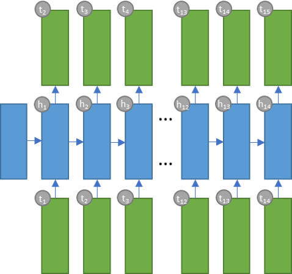

## Wilson's FM - Deep Playlist Generator

Alistair Wilson Gillespie  
April 19, 2020

## Machine Learning Engineer Capstone Report	
### Background
Wilson's Morning Wake Up (WMW) is a Spotify playlist I curate each month; the playlist is designed to
assist listeners in starting their day with no more than 15 tracks; and explores a range of genres including house, classical, funk and jazz, to name a few. WMW is structured in a way as to gently build in tempo and intensity - commencing with classical and minimalistic tracks - then introducing dance, house and electronic tracks later in the playlist, culminating in an hour or so of blissful listening.

### Define
Quality playlists take time and effort to curate. I thought it would be cool to train a model that generates beautiful playlists on demand, as a service. This project is an attempt match this ambition whilst also generating playlists of the same quality and structure as the WMW volumes.

To be effective, the project needed to perform the following tasks:

1. Extract metadata about all of the WMW playlists to date.
2. Transform track metadata.
3. Train a sequence estimator that learns the traits and relationships of each playlist.
4. Create a playlist using the estimator and Spotify's recommendation API.
5. Post a playlist to Spotify at Wilson's FM.

### Analyze
The WMW dataset comprises 37 volumes comprising up to 16 tracks. There is a total of 554 tracks in the dataset. Strictly speaking, it should be no longer than 15 tracks but I did get excited a few times. The dataset was sourced using the Spotify for Developers API and includes a set of audio features engineered by the Spotify team. Furthermore, I've included an additional attribute for track position to guide the sequence models discussed later in this report.

The following features were selected to represent each track:

- *acousticness*: confidence score of whether the track is acoustic (float)
- *danceability*: how suitable the track is for dancing based on a combination of musical elements (float)
- *energy*: measure of the intensity and activity of the track (float)
- *instrumentalness*: confidence score of whether the track has vocals or not (float)
- *liveness*: detects presence of an audience in the recording (float)
- *loudness*: overall loudness of a track in decibels (float)
- *speechiness*: detects presence of spoken words in a track (float)
- *tempo*: estimated tempo of a track in beats per minute (BPM) (float)
- *popularity*: popularity of the track represented by a value between 0 and 100, with 100 being the
 most popular (integer)
- *genres*: a list of genres used to classify the album in which the track features (array of strings)
- *song position*: position of the track in the respective WMW playlist (integer)

Figure 1 illustrates the distribution of the above features against each track position for all WMW volumes. In general, each feature tends to trend upwards as the playlist progresses, as depicted below.

<p align="center">
  
  <center><b>Fig. 1: Mean feature values against each track position for all WMW volumes</b></center>
</p>

Further information regarding the audio features can be found [here](https://developer.spotify.com/documentation/web-api/reference/tracks/get-several-audio-features/).

Principle Component Analysis (PCA) was used to reduce the number of dimensions for analysis and track comparisons. The data was transformed and projected into a 3-dimensional space to give a visual representation of tracks at each position. This view (in Figure 2) provides insights about the relative variance of tracks selected at each position. Track positions 7, 8 , 11 and 12 tend to cluster closely together and resemble higher degrees of feature similarity. These tracks tend to be house and dance tracks of higher tempo. Conversely, track positions 1, 2 and 3 show higher variance which is interesting given position 1 is always a classical track and positions 2 and 3 are generally minimal electronic tracks. 


<p align="center">
  
  <center><b>Fig. 2: PCA analysis at each track position for all WMW playlists</b></center>
</p>

Next, a view of each WMW volume was produced, pictured in the following figure. This view shows how each playlist moves through feature space over its duration. Interestingly, when I started this project, I anticipated that each playlist would resemble similar trends and behaviour. This view clearly shows that WMW volumes can vary significantly in feature composition and traits. For example, Volume 13 traverse in multiple directions as it plays out, however, Volume 27 tends to traverse laterally.

<p align="center">
  
  <center><b>Fig. 3: PCA analysis of a sample of volumes</b></center>
</p>

Finally, I decided to look at all of the WMW volumes in a single plot to try and discern any relationships or clusters of tracks (Figure 4). I wanted to test whether tracks at a given position were situated close to one another in feature space. Simply eyeballing the below chart shows little signs of distinct groups of tracks at a particular position. Rather there is quite a lot of variance across the whole sequence in features space. The only trait I can see is that a number of tracks at position 1 are positioned to the right as clear outliers.

<p align="center">
  
  <center><b>Fig. 4: PCA analysis of all volumes</b></center>
</p>
The code used to carriy out this analysis can be found in the '1_Explore.ipynb' and '2_Feature_Engineering.ipynb' notebooks.

TODO: Analysis of linear combinations of features in each component

### Implement

Python was used for this project along with prominent tools such as PyTorch, Pandas and Numpy. 

The project was structured like so:

```bash
.
|-- artefacts/ # Save models and artefacts here
	|-- dim_red.pkl # Principal Component Analysis
	|-- lstm_model.pth # Long Short-Term Memory Neural Network
	|-- rnn_model.pth # Vanilla Recurrent Neural Network
	|-- standard_features.pkl # Standard Scaler
|-- data/
    |-- tensor_train.csv # Training dataset
    |-- wmw.csv # Pool of Wilson's Morning Wake Up tracks to date
|-- model/
    |-- LSTMEstimator.py # LSTM Model with initialisation and feed-forward
    |-- LSTMTrain.py # Code for training the LSTM on AWS SageMaker
    |-- PlaylistDataset.py # Dataset Class
    |-- Predict.py # Code for predictions on AWS SageMaker
    |-- RNNEstimator.py # RNN Model with initialisation and feed-forward
    |-- RNNTrain.py # Code for training the RNN on AWS SageMaker
|-- img/
    |-- ...
|-- .gitignore # ...
|-- 0_Setup_Database.ipynb # Databased Setup for future use
|-- 1_Explore.ipynb # Initial data ingestion and analaysis
|-- 2_Feature_Engineering.ipynb # Feature preparation and further analysis
|-- 3_Train_Deploy_LOCAL.ipynb # Pipeline for training each model locally
|-- 4_Train_Deploy_AWS.ipynb # Pipeline for training each model on AWS SageMaker
|-- 5_Generate.ipynb # Generates a playlist and posts to Spotify
|-- LICENSE # MIT License
|-- local_env.yml # Environment details
|-- main.py # Pipeline that generates a playlist and posts to Spotify via CLI
|-- playlist.py # Playlist class
|-- PROPOSAL.md # Project Proposal
|-- README.md # ...
|-- REPORT.md # Project Report
```

#### Data Preprocessing

The dataset was prepared in a way to ensure that each track was mapped to the following track it precedes in the respective WMW volumes. The green boxes in Figure 2 show this mapping as the model moves vertically and to the right. This was executed by mirroring the features of each track, shifting the data by a single position backwards, and lastly, mapping the tracks to original track dataset. A StandardScaler was used to standardize the feature set and ensure that the model does not bias a particular feature due to variance. These steps were carried out in the '2_Feature_Engineering.ipynb' notebook.

Next, a PlaylistDataset class was built to serve as an iterable over the dataset. A DataLoader was then used to fetch batches - equivalent to the size of a playlist - from a PlaylistDataset object during training time. A fixed-sequence of 12 tracks was used instead of a variable-sequence for simplicity. The reason for this being that WMW volumes to date have ranged from 12 tracks, all the way up to 16 tracks. Future iterations of this project will likely account for variable-length sequences.

#### Modelling & Learning

The Mean Absolute Error - alternatively called the L1Loss in PyTorch - was selected to evaluate the performance of each model during training time. MAE was used over Mean Squared Error (MSE) because it is more robust to outliers since it does not raise to the power of 2. MAE served as the loss function for the model. It is worth noting that, a little bit of error is tolerable given it could enable model "creativity" or the ability to suggest unique track selections during playlist creation. However, the true indicator of performance is the listening experience, as a result, each playlist was "tested" in the living room of our house by my housemates and I.

<p align="center">
  
<center><b>Fig. 5:  Notation for Mean Average Error</b></center>
</p>

To achieve the objective of predicting the attributes of the next track given the current track, it was decided that a many-to-many recurrent neural network would suffice (Figure 2). At each epoch, the model was trained on the entire dataset. The dataset was iterated over, a single batch at a time. At each batch, the model's hidden state was initialised with zeros. Then each track in the batch was provided as a forward pass, one at a time, until the batch was exhausted. At each forward pass, the model produced an output along with an updated hidden state. The output was then compared with the ground truth to calculate the MAE loss. The output and hidden state were then used as input for the next prediction. The average MAE loss for the entire batch was then calculated and stored for record. 

A Vanilla Recurrent Neural Network (RNN) was chosen as the baseline model and a Long Short-Term Memory Model (LSTM) was chosen as the alternative model. Each model followed the aforementioned training process. Each model was defined with an input of 9 features, 2 hidden layers of 30 dimensions, and  an output of 9 dimensions. For regularization, a dropout of 0.3 was chosen. Given this is a small dataset, it was decided that the models use simple parameters.

I decided to build pipelines for both local and AWS SageMaker environments. Each implementation can be found in the Train_Deploy_Local and 'Train_Deploy_AWS.ipynb' notebooks. Once the modes were trained, they were then saved in the artefacts folder.

<p align="center">
  
  <center><b>Fig. 6: Many-to-many RNN: the model's hidden state (h) is initiated then each following track (t+1) is predicted using the current hidden state and current track (t) as input until the last track position.</b></center>
</p> 
<p align="center">
  
<center><b>Fig. 7: Example Recurrent Neural Network Unit for Track Estimating</b></center>
</p>


#### Deployment

The Playlist class was defined to perform the following tasks:

1. Connect to the Spotify API.
2. Initiate the playlist, model and variables.
3. Select the first track.
4. Predict the features of each subsequent track.
5. For each track position: 
   1. Gather a pool of recommendations via the Spotify API.
   2. Filter tracks that are harmonically compatible with the previous track using the [Camelot Wheel](http://www.harmonic-mixing.com/howto.aspx) created by Mark Davis.
   3. Apply PCA to the output of the model and the recommendations pool.
   4. Choose the track from the recommendations pool that is closest to the output using euclidean distance.
   5. Append the chosen track to the playlist.
6. Once the playlist is complete (15 tracks) post it to my Spotify account.

### Results
It is expected that the solution will pick tracks, conditioned by the context in which they appear, to deliver harmonic track sequences that closely rese	mble the manually crafted volumes to date. In theory, Vanilla RNNs can persist such information across sequences of input data but in practice commonly fall short. Then came along Long Short-Term Memory networks capable of persisting longer-term contexts of information. Christoper Olah's insightful images pictured below display the differences in how Vanilla RNNs and LSTMs persist information across sequences of inputs and outputs:


<p align="center">
  
<center><b>Fig. 3: Example of a Vanilla Recurrent Neural Network (<a href="https://colah.github.io/">Christopher Olah 2015</a>)</b></center>
</p>

<p align="center">
  
<center><b>Fig. 4: Example of a Long Short Term Memory Network (<a href="https://colah.github.io/posts/2015-08-Understanding-LSTMs/">Christopher Olah 2015</a>)</b></center>
</p>

For benchmarking, a Vanilla RNN architecture will be used to assess overall performance against a LSTM candidate model.  The models will be evaluated upon one of the loss functions detailed in the next section.

### Conclusion

The Mean Squared Error (MSE) and Mean Absolute Error (MAE) metrics will be considered as loss
functions for the evaluation of the candidate models. MSE and MAE are defined as follows ([Peltarion 2020](https://peltarion.com/knowledge-center/documentation/evaluation-view/regression-loss-metrics)):

<p align="center">
  
<center><b>Fig. 5:  Notation for the Mean Squared Error and Mean Average Error Loss Functions</b></center>
</p>

It is important to note that MAE is not as sensitive to outliers compared with MSE, thus for examples with the same input features, the result will be the median target values. In contrast, MSE is suited to scenarios where the target values - conditioned on the input features - are normally distributed. 

### Project Design
The workflow will be structured in a way that is closely aligned to the [Team Data Science Process](https://docs.microsoft.com/en-us/azure/machine-learning/team-data-science-process/overview) defined by Microsoft whilst also inheriting elements from Udacity's standard project structure. As a result, an iterative data science methodology will be followed to deliver the project. The key steps are pictured below and are explained in the subsequent sections:


<p align="center">
  
<center><b>Fig. 6: Project Data Science Process with Key Project Notebooks</b></center>
</p>


The project [code](https://github.com/alistairwgillespie/wmw_deep_playlist_generator) will be structured - subject to change - as follows:

```bash
.
|-- artefacts/ # Save models and artefacts here
	|-- dim_red.pkl # Principal Component Analysis
	|-- lstm_model.pth # Long Short-Term Memory Neural Network
	|-- rnn_model.pth # Vanilla Recurrent Neural Network
	|-- standard_features.pkl # Standard Scaler
|-- data/
    |-- tensor_train.csv # Training dataset
    |-- wmw.csv # Pool of Wilson's Morning Wake Up tracks to date
|-- model/
    |-- LSTMEstimator.py # LSTM Model with initialisation and feed-forward
    |-- LSTMTrain.py # Code for training the LSTM on AWS SageMaker
    |-- PlaylistDataset.py # Dataset Class
    |-- Predict.py # Code for predictions on AWS SageMaker
    |-- RNNEstimator.py # RNN Model with initialisation and feed-forward
    |-- RNNTrain.py # Code for training the RNN on AWS SageMaker
|-- img/
    |-- ...
|-- .gitignore # ...
|-- 0_Setup_Database.ipynb # Databased Setup for future use
|-- 1_Explore.ipynb # Initial data ingestion and analaysis
|-- 2_Feature_Engineering.ipynb # Feature preparation and further analysis
|-- 3_Train_Deploy_LOCAL.ipynb # Pipeline for training each model locally
|-- 4_Train_Deploy_AWS.ipynb # Pipeline for training each model on AWS SageMaker
|-- 5_Generate.ipynb # Generates a playlist and posts to Spotify
|-- LICENSE # MIT License
|-- local_env.yml # Environment details
|-- main.py # Pipeline that generates a playlist and posts to Spotify via CLI
|-- playlist.py # Playlist class
|-- PROPOSAL.md # Project Proposal
|-- README.md # ...
|-- REPORT.md # Project Report
```
#### Data Extraction and Exploratory Data Analysis

To extract the data, I will use Spotipy - which leverages the Spotify for Developers API - to query my account and return all track metadata for each of the WMW volumes into a Pandas DataFrame. All data extraction related code will be defined within the 'utilities.py' file for use across the code base and notebooks.

Next, the data will be analyzed using descriptive statistics and visualizations within the '1_Explore'
notebook. This phase of work will consider the distribution and nature of the feature set such as data types, outliers and feature correlation. The resulting findings will then inform any required feature engineering tasks in the following phase of development. The tools used to conduct this analysis will include - but not limited to - Seaborn, Matplotlib and Pandas.

#### Feature Engineering

An iterative approach will be used - by moving back and forth - between explorative data analysis, feature engineering and modeling to optimize the solution. The '2_Feature_Engineering' notebook will comprise any preliminary data preprocessing tasks, such as the following activities:

- Standardization of numerical features
- Normalization of numerical features
- Encoding of categorical features
- Feature Reduction and Aggregation
- Harmonic feature engineering such as 'mixing in key' 
- Outlier exclusion
- Cross-validation (i.e. train/test splitting)
- Storage of preprocessed dataset on AWS for downstream training

#### Modeling & Learning

PyTorch will provide the necessary tools to define and train the benchmark and candidate models. 

For modeling and training, the following tasks will be performed:

1. Load training and validation datasets into memory

2. Define the network architectures for each of the RNN models
3. Define the loss function
4. Train the networks
5. Monitor validation and training loss
6. Evaluate and select the winning model

The primary focus of this phase will be to consider the problem domain at hand, and any key findings, to configure the network appropriately, in particular, the input vector dimensions (feature set), number of hidden layers, output vector dimensions and regularization (Figure 7).


#### Estimation and Playlist Generation

Lastly, the chosen model will  be used to select tracks at each position of the target playlist by:

- Extracting a bunch of candidate tracks using track, artist and genre seeds via Spotipy
- Selecting tracks for each position according to the model's predicted output vectors (audio features) using selection thresholds

Furthermore, a Python Playlist class will be defined to construct objects that will facilitate the creation of playlists.

#### Future Considerations

Future iterations of this solution may consider deployment options such as a web interface to allow users to train their own deep playlist model based on any defined playlists. Furthermore, collaborative filtering is another exciting option for sourcing more meaningful track recommendations for playlist selection.

### References

Thank you to the following authors for providing excellent insights and inspiration for this project:

*The Unreasonable Effectiveness of Recurrent Neural Networks 2015, Andrej Karpathy, accessed 1 March 2020, [http://karpathy.github.io/2015/05/21/rnn-effectiveness/](http://karpathy.github.io/2015/05/21/rnn-effectiveness/).*

*RRN Music Recommender 2019, Taylor Hawks, accessed 26 February 2020, https://github.com/taylorhawks/RNN-music-recommender.*

*Understanding LSTM Networks 2015, Christopher Olah, accessed 26 February 2020, https://colah.github.io/posts/2015-08-Understanding-LSTMs/.*

*Regression loss metrics 2020, Peltarion, accessed 1 March 2020, https://peltarion.com/knowledge-center/documentation/evaluation-view/regression-loss-metrics.*

*Team Data Science Process 2020, Microsoft, accessed 1 March 2020, https://docs.microsoft.com/en-us/azure/machine-learning/team-data-science-process/overview.*