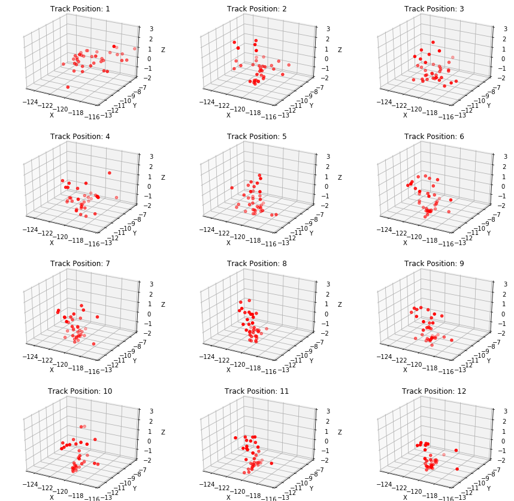
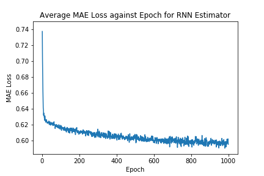

<p align="center"></p>


## Wilson's FM - Deep Playlist Generator

Alistair Wilson Gillespie  
April 20, 2020

### Background
Wilson's Morning Wake Up (WMW) is a Spotify playlist I curate each month; the playlist is designed to
assist listeners in starting their day with no more than 15 tracks; and explores a range of genres including house, classical, funk and jazz, to name a few. WMW is structured in a way as to gently build in tempo and intensity - commencing with classical and minimalistic tracks - then building up to dance, house and electronic tracks later in the playlist, culminating in an hour or so of blissful listening.

### Define
Quality playlists take time and effort to curate. I thought it would be cool to train a model that generates beautiful playlists on demand. This project is an attempt to solve this problem whilst also generating playlists of the same quality and structure as the WMW volumes.

To be effective, the project needed to perform the following tasks:

1. Extract metadata about all of the WMW playlists to date.
2. Transform track metadata.
3. Train a sequence estimator that learns the traits and relationships of each playlist.
4. Create a playlist using the estimator and Spotify's recommendation API.
5. Post a playlist to Spotify at Wilson's FM.

### Analyze
The WMW dataset comprises 37 volumes comprising up to 16 tracks. There is a total of 554 tracks in the dataset. Strictly speaking, it should be no longer than 15 tracks but I did get excited a few times. The dataset was sourced using the Spotify for Developers API and includes a set of audio features engineered by the Spotify team. Furthermore, I've included an additional attribute for track position to guide the sequence models discussed later in this report.

***To extract the data, I will use Spotipy - which leverages the Spotify for Developers API - to query my account and return all track metadata for each of the WMW volumes into a Pandas DataFrame. All data extraction related code will be defined within the 'utilities.py' file for use across the code base and notebooks.**

**Next, the data will be analyzed using descriptive statistics and visualizations within the '1_Explore'**
**notebook. This phase of work will consider the distribution and nature of the feature set such as data types, outliers and feature correlation. The resulting findings will then inform any required feature engineering tasks in the following phase of development. The tools used to conduct this analysis will include - but not limited to - Seaborn, Matplotlib and Pandas.****

The following features were selected to represent each track:

- *acousticness*: confidence score of whether the track is acoustic (float)
- *danceability*: how suitable the track is for dancing based on a combination of musical elements (float)
- *energy*: measure of the intensity and activity of the track (float)
- *instrumentalness*: confidence score of whether the track has vocals or not (float)
- *liveness*: detects presence of an audience in the recording (float)
- *loudness*: overall loudness of a track in decibels (float)
- *speechiness*: detects presence of spoken words in a track (float)
- *tempo*: estimated tempo of a track in beats per minute (BPM) (float)
- *popularity*: popularity of the track represented by a value between 0 and 100, with 100 being the
 most popular (integer)
- *genres*: a list of genres used to classify the album in which the track features (array of strings)
- *song position*: position of the track in the respective WMW playlist (integer)

Figure 1 illustrates the distribution of the above features against each track position for all WMW volumes. In general, each feature tends to trend upwards as the playlist progresses, as depicted below.

<p align="center">
  
  <center><b>Fig. 1: Mean feature values against each track position for all WMW volumes</b></center>
</p>

Further information regarding the audio features can be found [here](https://developer.spotify.com/documentation/web-api/reference/tracks/get-several-audio-features/).

Principle Component Analysis (PCA) was used to reduce the number of dimensions for analysis and track comparisons. The data was transformed and projected into a 3-dimensional space to give a visual representation of tracks at each position. This view (in Figure 2) provides insights about the relative variance of tracks selected at each position. Track positions 7, 8 , 11 and 12 tend to cluster closely together and resemble higher degrees of feature similarity. These tracks tend to be house and dance tracks of higher tempo. Conversely, track positions 1, 2 and 3 show higher variance which is interesting given position 1 is always a classical track and positions 2 and 3 are generally minimal electronic tracks. 


<p align="center">
  
  <center><b>Fig. 2: PCA analysis at each track position for all WMW playlists</b></center>
</p>

Next, a view of each WMW volume was produced, pictured in the following figure. This view shows how each playlist moves through feature space over its duration. Interestingly, when I started this project, I anticipated that each playlist would resemble similar trends and behaviour. This view clearly shows that WMW volumes can vary significantly in feature composition and traits. For example, Volume 13 traverse in multiple directions as it plays out, however, Volume 27 tends to traverse laterally.

<p align="center">
  
  <center><b>Fig. 3: PCA analysis of a sample of volumes</b></center>
</p>

Finally, I decided to look at all of the WMW volumes in a single plot to try and discern any relationships or clusters of tracks (Figure 4). I wanted to test whether tracks at a given position were situated close to one another in feature space. Simply eyeballing the below chart shows little signs of distinct groups at a particular track position. Rather, there is significant variance evident at each position. The only trait I can see is that a number of tracks at position 1 are positioned to the right as clear outliers.

<p align="center">
  
  <center><b>Fig. 4: PCA analysis of all volumes</b></center>
</p>
The code used to carry out this analysis can be found in the '1_Explore.ipynb' and '2_Feature_Engineering.ipynb' notebooks.


### Implement

Python was used for this project along with prominent tools such as PyTorch, Pandas and Numpy. 

The project was structured like so:

```bash
.
|-- artefacts/ # Save models and artefacts here
	|-- dim_red.pkl # Principal Component Analysis
	|-- lstm_model.pth # Long Short-Term Memory Neural Network
	|-- rnn_model.pth # Vanilla Recurrent Neural Network
	|-- standard_features.pkl # Standard Scaler
|-- data/
    |-- tensor_train.csv # Training dataset
    |-- wmw.csv # Pool of Wilson's Morning Wake Up tracks to date
|-- model/
    |-- LSTMEstimator.py # LSTM Model with initialisation and feed-forward
    |-- LSTMTrain.py # Code for training the LSTM on AWS SageMaker
    |-- PlaylistDataset.py # Dataset Class
    |-- Predict.py # Code for predictions on AWS SageMaker
    |-- RNNEstimator.py # RNN Model with initialisation and feed-forward
    |-- RNNTrain.py # Code for training the RNN on AWS SageMaker
|-- img/
    |-- ...
|-- .gitignore # ...
|-- 0_Setup_Database.ipynb # Databased Setup for future use
|-- 1_Explore.ipynb # Initial data ingestion and analaysis
|-- 2_Feature_Engineering.ipynb # Feature preparation and further analysis
|-- 3_Train_Deploy_LOCAL.ipynb # Pipeline for training each model locally
|-- 4_Train_Deploy_AWS.ipynb # Pipeline for training each model on AWS SageMaker
|-- 5_Generate.ipynb # Generates a playlist and posts to Spotify
|-- LICENSE # MIT License
|-- local_env.yml # Environment details
|-- main.py # Pipeline that generates a playlist and posts to Spotify via CLI
|-- playlist.py # Playlist class
|-- PROPOSAL.md # Project Proposal
|-- README.md # ...
|-- REPORT.md # Project Report
```

#### Data Preprocessing

The dataset was prepared in a way to ensure that each track was mapped to the following track it precedes in the respective WMW volumes. The green boxes in Figure 2 show this mapping as the model moves vertically and to the right. This was executed by mirroring the features of each track, shifting the data backwards by a single position, then mapping the tracks to the original track dataset. 

A StandardScaler was used to standardize the feature set and ensure that the model does not hold any bias toward a particular feature due to variance. These steps were carried out in the '2_Feature_Engineering.ipynb' notebook. A PCA was used to decompose the dataset into a set of three components. This transformer is used to select tracks by reducing the dimensionality of the model output and recommended tracks. The recommended track with the minimal Euclidean distance from the output is selected as the next track (refer to the pick_optimal_track in the Playlist class).

Next, a PlaylistDataset class was built to serve as an iterable over the dataset. A DataLoader was then used to fetch batches - equivalent to the size of a playlist - from the PlaylistDataset object during training time. A fixed-sequence of 12 tracks was used instead of a variable-sequence for simplicity. The reason for this being that WMW volumes to date have ranged from 12 tracks, all the way up to 16 tracks. Future iterations of this project will likely extend the PlaylistDataset class and account for variable-length playlists. The biggest challenge in this project was implementing a PyTorch Dataset in a way that I understood and the models would accept without errors. 

#### Modelling & Learning

The Mean Absolute Error - alternatively called the L1Loss in PyTorch - was selected to evaluate the performance of each model during training time. MAE was used over Mean Squared Error (MSE) because it is more robust to outliers since it does not raise to the power of 2 ([Peltarion 2020](https://peltarion.com/knowledge-center/documentation/evaluation-view/regression-loss-metrics)). MAE served as the loss function for the model. It is worth noting that, a little bit of error is tolerable given it could enable model "creativity" or the ability to make interesting track selections. However, the true indicator of performance is the listening experience thus each playlist was "tested" in the living room of our house by my housemates and I whilst working from home during COVID-19.

<p align="center">
  
<center><b>Fig. 5:  Notation for Mean Absolute Error</b></center>
</p>

To achieve the objective of predicting sequences of tracks, it was decided that a many-to-many recurrent neural network would suffice (Figure 2). Thus, a Vanilla Recurrent Neural Network (RNN) was chosen as the baseline model and a Long Short-Term Memory Model (LSTM) was chosen as the alternative model. To prevent overfitting the following formula was used to select the parameters for each model ([Hobs, 2015](https://stats.stackexchange.com/questions/181/how-to-choose-the-number-of-hidden-layers-and-nodes-in-a-feedforward-neural-netw/136542#136542)):


*=  number of input neurons*

 *=  number of output neurons*

*= number of samples in training dataset*

*= an arbitrary scaling factor usually 2-10*

In this case, the following values were entered to the above equation: 9 input neurons, 9 output neurons, an alpha value of 2 and a total of 444 unique samples. The resulting hidden dimensions came to approximately 12. As a result, each model was defined with an input of 9 features, 2 hidden layers of 12 dimensions and an output of 9 dimensions. For regularization, a dropout of 0.3. For optimization, Adam was selected with a default learning rate of 0.001 ([Kingma, 2014](https://arxiv.org/abs/1412.6980)). The parameters are pictured in Figure 5.

<p align="center">
  
  <center><b>Fig. 5: Parameters for each RNN</b></center>
</p>

Initially, the models were trained for 10 epochs to ensure they ran error-free and that fit was evident by observing the loss. 

At each epoch, the dataset was iterated over by picking a single batch at a time. At each batch, the model's hidden state was initialized with zeros; then each track in the batch was provided as a forward pass to the model. At each forward pass, the model produced an output along with an updated hidden state. The output was then compared with the ground truth to calculate the MAE loss. The output and hidden state were then used as input for the next prediction until the batch was exhausted. The average MAE loss for the entire batch was then calculated and stored for evaluation. 

I decided to build pipelines for both local and AWS SageMaker environments. Each implementation can be found in the '3_Train_Deploy_Local.ipynb' and '4_Train_Deploy_AWS.ipynb' notebooks. Models are saved in the artefacts folder for later use in deployment.


#### Deployment

The Playlist class was defined to perform the following tasks:

1. Connect to the Spotify API.
2. Initiate the playlist, model and variables.
3. Select the first track.
4. Predict the features of each subsequent track.
5. For each track position: 
   - Gather a pool of recommendations by using previous tracks from WMW via the Spotify API.
   - Filter tracks that are harmonically compatible with the previous track  - using the [Camelot Wheel](http://www.harmonic-mixing.com/howto.aspx) created by Mark Davis - based on key and mode (e.g. B Major with A-Flat Minor)
   - Apply PCA to the output of the model and the recommendations pool.
   - Choose the track from the recommendations pool that is closest to the output using Euclidean distance.
   - Append the chosen track to the playlist.
6. Once the playlist is complete (15 tracks) post it to the Wilson's FM playlist on Spotify.

The constructor and functions defined in the Playlist class make up a pipeline of the tasks above.  The following command will execute the 'main.py'. The 'main.py' then initializes a Playlist object, connects to Spotify and generates a playlist.

```bash
(local_wmw) C:\wmw_deep_playlist_generator> python main.py
```

#### Refinements

After generating a bunch of playlists, it quickly became apparent that selecting tracks solely on Spotify's audio features did not suffice. The playlists were not introducing with classical and minimalist tracks but instead following a random structure. Tracks can possess similar audio features but satisfy different music tastes completely. To refine track selection, I decided to refactor the 'get_position_recommendations" function. Instead of gathering recommendations using randomly sampled WMW tracks as seeds. I instead gathered recommendations for each track position by using tracks from previous WMW volumes. This refined the recommendation pool to tracks that match the genre and traits at that particular track position.

### Results

The following table shows the performance (MAE loss) of each model for different epoch limits during training:

|           |        | Epochs  |          |          |
| :-------: | :----: | :-----: | :------: | :------: |
| **Model** | **50** | **500** | **1000** | **1500** |
|    RNN    |        | 0.6024  |  0.5952  |  0.1022  |
|   LSTM    |        | 0.5746  |  0.0466  |  0.0174  |

<p align="center">
  
  
  <center><b>Fig. 4: MAE Loss against Epoch for RNN and LSTM</b></center>
</p>

Figure 6 shows the performance of each model for 1500 epochs of training. 


For benchmarking, a Vanilla RNN architecture will be used to assess overall performance against a LSTM candidate model.  The models will be evaluated upon one of the loss functions detailed in the next section.

### Conclusion

|           |        | Epochs  |          |          |
| :-------: | :----: | :-----: | :------: | :------: |
| **Model** | **50** | **500** | **1000** | **1500** |
|    RNN    |        |         |          |  0.1022  |
|   LSTM    |        |         |          |  0.0174  |

#### Future Considerations

Future iterations of this solution may consider deployment options such as a web interface to allow users to train their own deep playlist model based on any defined playlists. Furthermore, collaborative filtering is another exciting option for sourcing more meaningful track recommendations for playlist selection.

TODO: Analysis of linear combinations of features in each component

### References

Thank you to the following authors for providing excellent insights and inspiration for this project:

*The Unreasonable Effectiveness of Recurrent Neural Networks 2015, Andrej Karpathy, accessed 1 March 2020, [http://karpathy.github.io/2015/05/21/rnn-effectiveness/](http://karpathy.github.io/2015/05/21/rnn-effectiveness/).*

*RRN Music Recommender 2019, Taylor Hawks, accessed 26 February 2020, https://github.com/taylorhawks/RNN-music-recommender.*

*Understanding LSTM Networks 2015, Christopher Olah, accessed 26 February 2020, https://colah.github.io/posts/2015-08-Understanding-LSTMs/.*

*Regression loss metrics 2020, Peltarion, accessed 1 March 2020, https://peltarion.com/knowledge-center/documentation/evaluation-view/regression-loss-metrics.*

*Team Data Science Process 2020, Microsoft, accessed 1 March 2020, https://docs.microsoft.com/en-us/azure/machine-learning/team-data-science-process/overview.*

*How-To Guide 2020, Harmonix Mixing, accessed 1 March 2020,http://www.harmonic-mixing.com/howto.aspx.*

