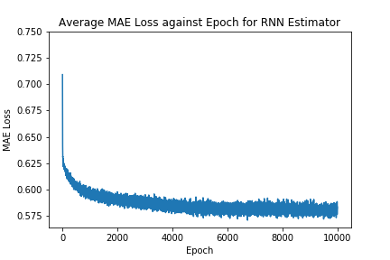

<p align="center"></p>


## Wilson's FM - Deep Playlist Generator

Alistair Wilson Gillespie  
April 20, 2020

### Background
Spotify is the leading incumbent of the music streaming industry boasting a dominant market share. To satisfy it's ever-evolving audience and fend off competitors, it harnesses an army of engineers and data scientists to infuse recommendation systems with its core functionality of playing music and podcasts. At its heart, Spotify has a rich user-base of curators and artists that contribute to the vast archives of sounds that listeners all around the world enjoy.

Wilson's Morning Wake Up (WMW) is a Spotify playlist I curate each month; the playlist is designed to assist listeners starting their day with no more than 15 tracks; and explores a range of genres including house, classical, funk and jazz, to name a few. WMW is structured in a way as to gently build in tempo and intensity - commencing with classical and minimalistic tracks - then building up to dance, house and electronic tracks later in the playlist, culminating in an hour or so of blissful listening.

### Define
Quality playlists take time and effort to curate. I thought it would be cool to train a model that generates beautiful and seamless playlists on demand. This project is an attempt to solve this problem using the WMW volume and Spotify API.

To tackle this problem, the project needed to perform the following tasks:

1. Extract metadata about all of the WMW playlists to date.
2. Transform track metadata.
3. Train a sequence estimator that learns the traits and relationships of each playlist.
4. Create a playlist using the estimator and Spotify's recommendation API.
5. Post a playlist to Spotify at Wilson's FM.

### Analyze
The WMW dataset comprises 37 volumes comprising up to 16 tracks. There is a total of 554 tracks in the dataset. Strictly speaking, it should be no longer than 15 tracks, but I did get excited a few times. The dataset was sourced using the Spotify for Developers API and includes a set of audio features engineered by the Spotify team. Furthermore, I've included an additional attribute for track position to guide the sequence models discussed later in this report.

To extract the data, I used Spotipy - a Python wrapper around the Spotify for Developers API - to query my account and return all track metadata from all the WMW volumes into a Pandas DataFrame. All data extraction code is defined in the '1_Explore.ipynb' notebook and save in the data folder. Spotipy provides a rich set of audio features.

The following features were selected to represent each track:

- *acousticness*: confidence score of whether the track is acoustic (float)
- *danceability*: how suitable the track is for dancing based on a combination of musical elements (float)
- *energy*: measure of the intensity and activity of the track (float)
- *instrumentalness*: confidence score of whether the track has vocals or not (float)
- *liveness*: detects presence of an audience in the recording (float)
- *loudness*: overall loudness of a track in decibels (float)
- *speechiness*: detects presence of spoken words in a track (float)
- *tempo*: estimated tempo of a track in beats per minute (BPM) (float)
- *popularity*: popularity of the track represented by a value between 0 and 100, with 100 being the
 most popular (integer)
- *genres*: a list of genres used to classify the album in which the track features (array of strings)
- *song position*: position of the track in the respective WMW playlist (integer)

Figure 1 illustrates the distribution of the above features at each track position for all WMW volumes. In general, each feature tends to trend upwards as the playlist progresses, as depicted below. This was anticipated since the playlist is curated in a way to build in tempo and intensity.

<p align="center">
  
  <center><b>Fig. 1: Mean feature values against each track position for all WMW volumes</b></center>
</p>
Further information regarding the audio features can be found [here](https://developer.spotify.com/documentation/web-api/reference/tracks/get-several-audio-features/).

Principle Component Analysis (PCA) was used to reduce the number of dimensions for analysis and track comparisons. The data was transformed and projected into a 3-dimensional space. This view (Figure 2) provided insights about the variance of tracks at each track position. Track positions 7, 8, 11 and 12 clustered closely together and resemble higher degrees of feature similarity. These tracks tend to be house and dance tracks at a higher tempo. Conversely, track positions 1, 2 and 3 were dispersed with higher variance. This was interesting given position 1 is always a classical track and positions 2 and 3 are consistently minimal electronic tracks that sound like human ear. 

<p align="center">
  
  <center><b>Fig. 2: PCA analysis at each track position for all WMW playlists</b></center>
</p>

Next, scatterplots for each WMW volume were produced (Figure 3). This view shows how each playlist moves through feature space over its duration. Interestingly, when I started this project, I anticipated that each playlist would resemble similar trends and behavior. This view clearly shows that WMW volumes can vary significantly in feature composition and traits. For example, Volume 13 traverses in several different directions, however, Volume 27 tends to traverse laterally as it plays out.

<p align="center">
  
  <center><b>Fig. 3: PCA analysis of a sample of volumes</b></center>
</p>

Finally, I decided to look at all the WMW volumes in a single plot to try and discern any relationships or clusters of tracks (Figure 4). I wanted to test whether tracks at a position were situated close to one another in feature space. Simply eyeballing the below chart shows little signs of distinct groups. Rather, there is a significant degree of variance evident at each position. The only trait I can see is that several tracks at position 1 are dispersed away from the core community of tracks. 

<p align="center">
  
  <center><b>Fig. 4: PCA analysis of all volumes</b></center>
</p>
The code used to carry out this analysis can be found in the '1_Explore.ipynb' and '2_Feature_Engineering.ipynb' notebooks.

For future iterations of this analysis, I am keen to explore further unsupervised techniques such as t-Distributed Stochastic Neighbor Embedding (*t*-*SNE*) and clustering algorithms. I believe this will lead to a greater understanding of track composition and selection. 

### Implement

Python was used for this project along with prominent tools such as PyTorch, Pandas and Numpy. 

The project was structured like so:

```bash
.
|-- artefacts/ # Save models and artefacts here
	|-- dim_red.pkl # Principal Component Analysis
	|-- lstm_model.pth # Long Short-Term Memory Neural Network
	|-- rnn_model.pth # Vanilla Recurrent Neural Network
	|-- standard_features.pkl # Standard Scaler
|-- data/
    |-- tensor_train.csv # Training dataset
    |-- wmw.csv # Pool of Wilson's Morning Wake Up tracks to date
|-- model/
    |-- LSTMEstimator.py # LSTM Model with initialisation and feed-forward
    |-- LSTMTrain.py # Code for training the LSTM on AWS SageMaker
    |-- PlaylistDataset.py # Dataset Class
    |-- Predict.py # Code for predictions on AWS SageMaker
    |-- RNNEstimator.py # RNN Model with initialisation and feed-forward
    |-- RNNTrain.py # Code for training the RNN on AWS SageMaker
|-- img/
    |-- ...
|-- .gitignore # ...
|-- 0_Setup_Database.ipynb # Databased Setup for future use
|-- 1_Explore.ipynb # Initial data ingestion and analysis
|-- 2_Feature_Engineering.ipynb # Feature preparation and further analysis
|-- 3_Train_Deploy_LOCAL.ipynb # Pipeline for training each model locally
|-- 4_Train_Deploy_AWS.ipynb # Pipeline for training each model on AWS SageMaker
|-- 5_Generate.ipynb # Generates a playlist and posts to Spotify
|-- LICENSE # MIT License
|-- local_env.yml # Environment details
|-- main.py # Pipeline that generates a playlist and posts to Spotify via CLI
|-- playlist.py # Playlist class
|-- PROPOSAL.md # Project Proposal
|-- README.md # ...
|-- REPORT.md # Project Report
```

#### Data Preprocessing

The dataset was prepared in a way to ensure that each track was mapped to the track it precedes in its respective WMW volume. The green boxes in Figure 2 show this mapping as the model moves vertically and to the right. This was executed by mirroring the features of each track, shifting the data backwards by a single position, then mapping the tracks to the original track dataset. 

A StandardScaler was then used to standardize the feature set and ensure that the model does not hold any bias toward a feature as a result of feature variance. These steps were carried out in the '2_Feature_Engineering.ipynb' notebook. A PCA was used to decompose the dataset into a set of three components. This transformer is later used to select tracks by reducing the dimensionality of the model output and recommended tracks; the recommended track with the minimal Euclidean distance to the output is then selected as the next track in the playlist (refer to the ‘pick_optimal_track’ function in the Playlist class).

Next, a PlaylistDataset class was built to serve as an iterable over the dataset. A DataLoader was then used to fetch batches - equivalent to the size of a playlist - from the PlaylistDataset object during model training. A fixed-sequence of 12 tracks rather than variable-sequence was selected for simplicity. The reason for this being that WMW volumes to date have ranged from 12 tracks, all the way up to 16 tracks. Future iterations of this project will likely extend the PlaylistDataset class and account for variable-length playlists. The biggest challenge in this project was implementing a PyTorch Dataset that can be parse by each model.

#### Modelling & Learning

The Mean Absolute Error - alternatively called the L1Loss in PyTorch - was selected to evaluate the performance of each model during training time. MAE was used over Mean Squared Error (MSE) because it is more robust to outliers since it does not raise to the power of 2 ([Peltarion 2020](https://peltarion.com/knowledge-center/documentation/evaluation-view/regression-loss-metrics)). It is worth noting that, a little bit of error is tolerable given it could enable model "creativity" or the ability to make interesting track selections. However, the true indicator of performance is the listening experience thus each playlist was "tested" in the living room by my housemates and I whilst working from home during COVID-19.

<p align="center">
  
<center><b>Fig. 5:  Notation for Mean Absolute Error</b></center>
</p>

To achieve the objective of predicting sequences of tracks, it was decided that a many-to-many recurrent neural network would suffice (Figure 2). Thus, a Vanilla Recurrent Neural Network (RNN) was chosen as the baseline model and a Long Short-Term Memory Model (LSTM) was chosen as the alternative model. To prevent overfitting the following formula was used to select the parameters for each model ([Hobs, 2015](https://stats.stackexchange.com/questions/181/how-to-choose-the-number-of-hidden-layers-and-nodes-in-a-feedforward-neural-netw/136542#136542)):


*=  number of input neurons*

 *=  number of output neurons*

*= number of samples in training dataset*

*= an arbitrary scaling factor usually 2-10*

In this case, the following values were entered to the above equation: 9 input neurons, 9 output neurons, an alpha value of 2 and a total of 444 unique samples. The resulting number of hidden neurons came to approximately 12. As a result, each model was defined with an input of 9 features, 2 hidden layers of 12 dimensions, output of 9 dimensions and batch size of 12. A dropout of 0.3 was chosen to combat overfitting. For optimization, Adam was selected with a default learning rate of 0.001 ([Kingma, 2014](https://arxiv.org/abs/1412.6980)). The parameters are pictured in Figure 5.

<p align="center">
  
  <center><b>Fig. 5: Parameters of each RNN</b></center>
</p>

Initially, the models were trained for 10 epochs to ensure they ran error-free and observe whether the loss was decreasing. 

At each epoch, the dataset was iterated over via batches of 12 tracks. The model hidden state was then initialized. At each forward pass, the model produced an output along with an updated hidden state. The output was then compared with the ground truth to calculate the MAE loss. The average MAE loss for the entire data loader was then calculated and stored for reporting.

I decided to build pipelines for both local and AWS SageMaker environments. Each implementation can be found in the '3_Train_Deploy_Local.ipynb' and '4_Train_Deploy_AWS.ipynb' notebooks. Models are saved in the artefacts folder for user by the Playlist class in deployment. When the playlist grows to a considerably larger scale, I will most likely leverage AWS Sagemaker and GPUs to more efficiently train and deploy this service.

#### Deployment

For the initial release, I decided to setup a main.py for execution in the command line. 

```bash
(local_wmw) C:\wmw_deep_playlist_generator> python main.py
```

The following command will execute the 'main.py' which in turn will initialize a Playlist object that connects to Spotify and generates a playlist.

The Playlist class performs the following tasks:

1. Connect to the Spotify API.
2. Initiate the playlist, model and variables.
3. Select the first track.
4. Predict the features of each subsequent track.
5. For each track position: 
   - Gather a pool of recommendations by using previous tracks from WMW via the Spotify API.
   - Filter tracks that are harmonically compatible with the previous track  - using the [Camelot Wheel](http://www.harmonic-mixing.com/howto.aspx) created by Mark Davis - based on key and mode (e.g. B Major with A-Flat Minor)
   - Apply PCA to the output of the model and the recommendations pool.
   - Choose the track from the recommendations pool that is closest to the output using Euclidean distance.
   - Append the chosen track to the playlist.
6. Once the playlist is complete (15 tracks) post it to the Wilson's FM playlist on Spotify.

The following screenshot illustrates a playlist that was generated by a Playlist object.


#### Refinements

After generating a bunch of playlists, it  became apparent that selecting tracks solely on Spotify's audio features did not suffice. The playlists were not starting with classical and minimalist tracks but instead following a random structure foreign to previous WMW volumes. Tracks can possess similar audio features but satisfy different music genres completely. To refine track selection, I decided to refactor the 'get_position_recommendations" function. Instead of gathering recommendations using randomly sampled WMW tracks as seeds, I instead gathered recommendations for each track position by using tracks at the same position from previous WMW volumes. This refined the recommendation pool to tracks that match the genre and traits at that track position.

### Results

The following table shows the performance (MAE loss) of each model for different epoch limits during training:

|           |        |         |  Epochs  |          |          |           |
| :-------: | :----: | :-----: | :------: | :------: | :------: | :-------: |
| **Model** | **50** | **500** | **1000** | **1500** | **2000** | **10000** |
|    RNN    | 0.6244 | 0.6024  |  0.5956  |  0.5954  |  0.5943  |  0.5835   |
|   LSTM    | 0.6162 | 0.5746  |  0.5506  |  0.5473  |  0.5326  |           |

<p align="center"><center><b>Table. 1: MAE Loss for different Epochs </b></center></p>

<p align="center">
  
  
  <center><b>Fig. 4: MAE Loss against Epoch for RNN and LSTM</b></center>
</p>

Figure 6 shows the performance of each model for 2000 epochs of training. The LSTM recorded a significant 10.95% lower loss than the baseline RNN over 10000 epochs. 10000 epochs was sufficient in the end given very little improvements in error were observed between 2000 and 10000, especially in the case of the RNN. 

### Conclusion

This project only scratches the surface of what is possible when it comes to deep learning and playlist creation. Recurrent neural networks are a powerful way of modelling track sequences, especially, when it combined with Spotify's API, and I believe I have much unfinished business to take this project further.

The LSTM model was selected as the optimal model for this problem given its ability to fit the data better than its baseline RNN counterpart. This model - married with feature decomposition and distance similarity - produced melodic playlists of high quality that resemble the origin Wilson's Morning Wake Up volumes. However, it must be said that the solution does sometimes select an odd track or two. This observation will drive this project forward as I try to employ further machine learning methods to optimize track selection.

### References

Thank you to the following authors for providing excellent insights and inspiration for this project:

*The Unreasonable Effectiveness of Recurrent Neural Networks 2015, Andrej Karpathy, accessed 1 March 2020, [http://karpathy.github.io/2015/05/21/rnn-effectiveness/](http://karpathy.github.io/2015/05/21/rnn-effectiveness/).*

*RRN Music Recommender 2019, Taylor Hawks, accessed 26 February 2020, https://github.com/taylorhawks/RNN-music-recommender.*

*Understanding LSTM Networks 2015, Christopher Olah, accessed 26 February 2020, https://colah.github.io/posts/2015-08-Understanding-LSTMs/.*

*Regression loss metrics 2020, Peltarion, accessed 1 March 2020, https://peltarion.com/knowledge-center/documentation/evaluation-view/regression-loss-metrics.*

*Team Data Science Process 2020, Microsoft, accessed 1 March 2020, https://docs.microsoft.com/en-us/azure/machine-learning/team-data-science-process/overview.*

*How-To Guide 2020, Harmonix Mixing, accessed 1 March 2020,http://www.harmonic-mixing.com/howto.aspx.*

